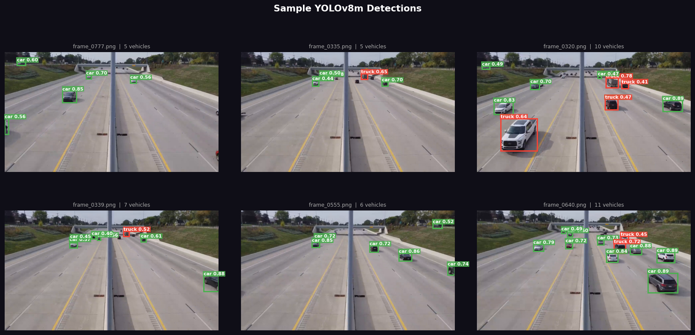
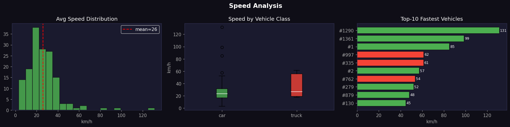
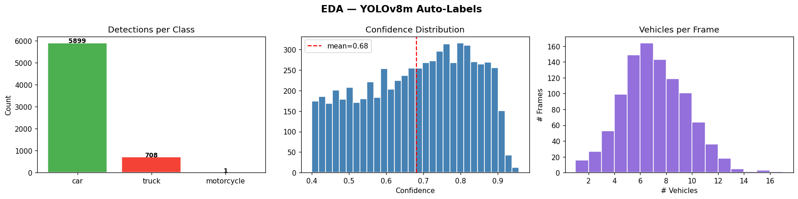
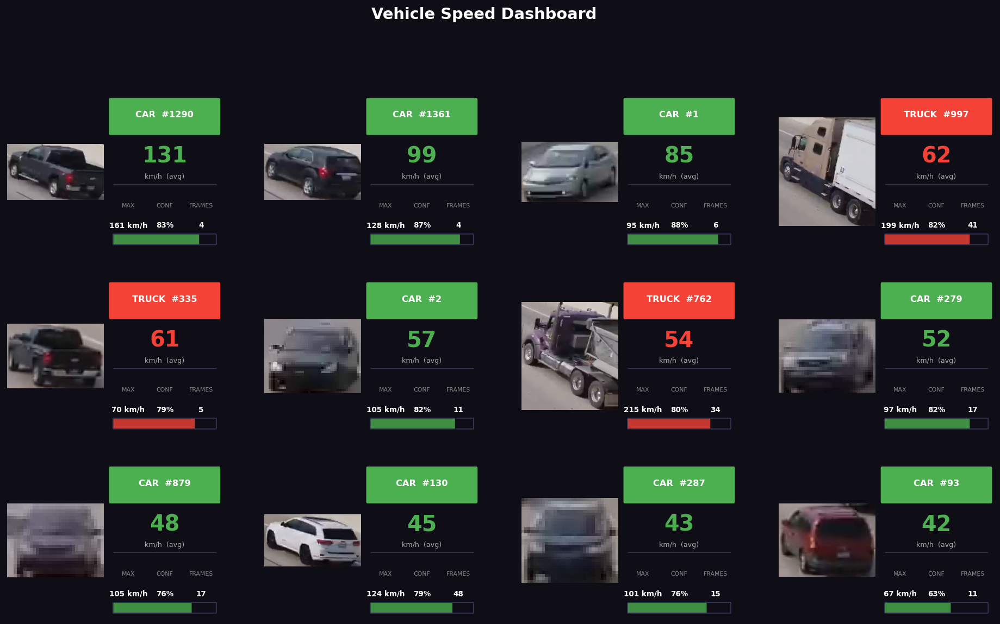

# 🚦 Traffic Detection System

An end-to-end **traffic video analytics pipeline** built with **YOLOv8**, multi-object tracking, speed estimation.

---

## 📌 Overview

| Stage | Details |
|-------|---------|
| **Input** | Real traffic video (1280×720, 30 fps, 150 s) |
| **Detection** | YOLOv8m — 4 vehicle classes (car, motorcycle, bus, truck) |
| **Tracking** | ByteTrack / SORT via `supervision` — persistent vehicle IDs |
| **Speed Estimation** | Per-vehicle speed from inter-frame displacement |
| **Output** | Annotated video, analytics dashboard, speed distribution plots |

---

## 🖼️ Results

| Sample Detections | Speed Analysis | EDA |
|:-:|:-:|:-:|
|  |  |  |

**Dashboard:**



---

## 📊 Detection Stats (1000 frames)

| Metric | Value |
|--------|-------|
| Frames with vehicles | 999 / 1000 |
| Total detections | 6,608 |
| Avg confidence | 0.682 |
| Avg vehicles / frame | 6.6 |
| Inference time (YOLOv8m) | ~36.8 s on T4 GPU |

```
[CAR         ] frame_0012.png  →  'MH 12 AB 1234'
[TRUCK       ] frame_0031.png  →  'GJ 05 CD 5678'
```

---

## 🛠️ Tech Stack

| Category | Tools |
|----------|-------|
| Detection | [Ultralytics YOLOv8](https://github.com/ultralytics/ultralytics) |
| Tracking | [Supervision](https://github.com/roboflow/supervision) + `lap` |
| Vision | OpenCV |
| ML / Arrays | NumPy, Pandas |
| Visualisation | Matplotlib |
| Runtime | Google Colab (T4 GPU) |

---

## 🚀 Run It Yourself

1. Open `traffic_detection_project.ipynb` in [Google Colab](https://colab.research.google.com/)
2. Upload your traffic video when prompted (Cell 2)
3. Run all cells top-to-bottom
4. Outputs saved to the `outputs/` directory

> **Requirements** are installed automatically by the first notebook cell:
> `ultralytics`, `supervision`, `yt-dlp`, `lap`, `easyocr`

---

## 📁 Repository Structure

```
Traffic-Detection-System/
├── traffic_detection_project.ipynb   # Main notebook
├── sample_detections.png             # Sample annotated frames
├── eda_labels.png                    # Class distribution charts
├── speed_analysis.png                # Speed histogram
├── car_speed_dashboard.png           # Full analytics dashboard
├── output.mp4                        # Annotated output video
└── traffic.mp4                       # Input traffic video
```
